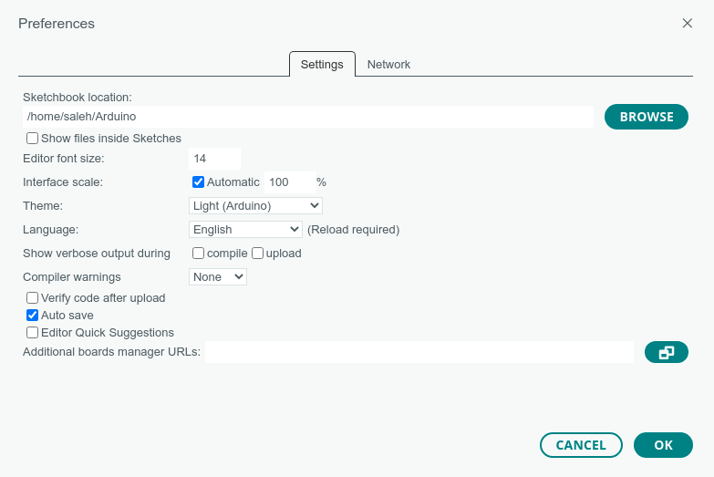

= Getting Started with ESP32 and Arduino IDE
Saleh AlSaleh
222, 07 February 2023

== Objectives

- Getting familiar with the ESP32 Platform

- Getting familiar with Arduino IDE

- Implementing Wi-Fi client on ESP32

== Parts List

- ESP32-S3
+
image::images/esp32_s3.png["ESP32-S3-DevKitC-1 board",474,355]

- USB A-Type to Micro-B cable
+

- Breadboard
+

- LED
+

- 330 Ohm Resistor 
+

== Background

=== Microcontroller

ESP32-S3-WROOM-1-N8R8 is a microcontroller manufactured by Espressif. ESP32-S3-WROOM-1-N8R8 is only one member of
a big family of microcontolles. The ESP32-S3-WROOM-1-N8R8 microcontroller is a Xtensa® dual-core 32-bit LX7 microprocessor. Some of its features include: CPU clock up to 240MHz,
384KB on-chip Flash ROM, 8MB External Flash, 512kB SRAM, 8MB PSRAM, 2.4 GHz Wi-Fi (802.11 b/g/n) up to 150Mbps, Bluetooth LE 5.0, SPI, LCD, Camera Interface, UARTs, I2C, I2S, general purpose I/O pins, full-speed USB 1.1 OTG interface, ADC and other peripherals.

The product data sheet for the ESP32-S3-WROOM-1-N8R8 microcontroller <<esp32-s3-data-sheet>> is essential resource for any developer.

ESP32-S3-WROOM-1-N8R8 microcontroller can be programmed by ESP-IDF (Espressif IDE), Arduino IDE, and Micropython. This guide will use Arduino IDE for programming the microcontroller.

=== Arduino IDE

The Arduino IDE is a free IDE software development environment for different types of microcontrollers such as Arduino Uno, Arduino Mega, Arduino Nano, ST STM32 microncontrollers and ESP32 microncontrollers.

By default, Arduino IDE only supports Arduino boards. However, support for other microcontrollers can be installed.

==== Installation

To install your copy of the Arduino IDE:

. Using a web browser, navigate to the
https://www.arduino.cc/en/software[Arduino Integrated Development Environment (IDE)] page.

. Use the download link that matches your operating system.

. Run the downloaded installer.

. After the installation has completed, open the Arduino IDE application.

. Open the Preferences window by clicking on the File Menu, then Preferences Item.
+

. Copy and paste the following link in the Additional board manager URLS.
https://raw.githubusercontent.com/espressif/arduino-esp32/gh-pages/package_esp32_dev_index.json
+

. Open the Board Manager window/panel by clicking on the Tools menu, then Board -> Board Manager .

. Type esp32 in the filter your search textbox, then install the esp32 boards by Espressif Systems.

==== Pin Layout

The pin layout of the ESP32-S3 board is shown in the
<<esp32-pin-layout>> figure below.

[[esp32-pin-layout]]
.ESP32-S3 pin layout
image::images/esp32_pinout.jpg["ESP32-S3 pin layout"]

=== Blinky Example

One of the basic examples to test a microcontroller is to test blinking an LED. Let's start by connecting a 330 Ohm resistor to pin 4 and the positive lead of the LED to the other end of the resistor and negative lead of the LED to GND of the microcontroller. 
Below is a sample code to blink an LED connected to GPIO pin 4. 

[source, c]
--------------------------------------------------
#define LED_PIN 4
void setup() {
    // configure the LED pin to be as a GPIO output
    pinMode(LED_PIN, OUTPUT);
}
void loop() {
    // turn the LED on (HIGH is the voltage level)
    digitalWrite(LED_PIN, HIGH);
    // wait for a second
    delay(1000);
    // turn the LED off by making the voltage LOW
    digitalWrite(LED_PIN, LOW);
    // wait for a second
    delay(1000);
}
--------------------------------------------------

Then, select the board "ESP32S3 Dev Module" from the Tools Menu -> Board -> esp32. 
Next, connect the ESP32 microcontoller to the computer and select the port number (e.g. COM3) from the Tools Menu.

[NOTE]
============================================
Make sure to select the Flash Size to be 8MB. 
In addition to that, ensure to have the PSRAM selected as OPI PSRAM. 
============================================

If you have everything configured and LED is connected properly, then the LED should be blinking. 

== Wi-Fi
The ESP32 microcontroller can be used as an Access Point (AP) or a Station (STA).

In Access Point mode, the ESP32 behaves like a WiFi network (a bit like a router): other devices can connect to it. In this mode, the ESP32 is not connected to any other network and is therefore not connected to the Internet. This mode is more computationally and energy-intensive (the ESP32 board will heat up) since the ESP32 has to simulate a full WiFi router (Soft AP). The latency and the bandwidth will be less efficient than in a classic router.

The Station mode (STA) is used to connect the ESP32 module to a WiFi access point. The ESP32 behaves like a computer that is connected to our router. If the router is connected to the Internet, then the ESP32 can access the Internet. The ESP32 can behave as a client: make requests to other devices connected to the network, or as a server: other devices connected to the network will send requests to the ESP32. In both cases, the ESP32 can access the Internet.

In many IoT applications, the ESP32 module will be used as a client that connects to an access point. 
The following client example shows how to connect an ESP32 module to an access point and send data to another server.
However, you can modify the arduin code to use the ESP32 as a server that receives requests from other clients on the same network.

[NOTE]
============================================================
Refer to Arduino WiFi library documentation <<arduino-wifi>>.
============================================================ 

[source, c]
--------------------------------------------------
// include Arduino WiFi library
#include <WiFi.h>

// WiFi netword SSID (i.e. name)
const char* ssid = "yourNetworkName";
// WiFi network password
const char* password = "yourNetworkPassword";

// Server IP Address
const char * host = "192.168.8.154";
// Server Port Number
const uint16_t port = 9090;

void setup() {
    // start Serial communication to the PC
    Serial.begin(115200);
    delay(1000);

    // setting mode for wifi (station, client)
    WiFi.mode(WIFI_STA);
    // connect to the wifi network
    WiFi.begin(ssid, password);
    Serial.println("\nConnecting");

    // wait until the client is connected to the network
    while(WiFi.status() != WL_CONNECTED) {
        Serial.print(".");
        delay(100);
    }

    // Printing IP Address of the client
    Serial.println("\nConnected to the WiFi network");
    Serial.print("Local ESP32 IP: ");
    Serial.println(WiFi.localIP());
}

void loop() {
    WiFiClient client;
    if (!client.connect(host, port)) {
        Serial.println("Connection to host failed");
    // wait one second before attempting to connect to server
        delay(1000);
    }
    else {
        // server connection established
        Serial.println("Connected to server successful!");
        // send a message to server
        client.print("Hello from COE454");
        Serial.println("Disconnecting...");
        // terminate connection to server
        client.stop();
        // wait for 10 seconds before sending the next request
        delay(10000);
    }
}
--------------------------------------------------

The server could be as complex as a cloud based server or a simple as the following python script running on a computer connected to the same network of the ESP32.

[NOTE]
============================================================
Refer to python socket library for more information <<python-socket>>.
============================================================ 

[source, python]
--------------------------------------------------
# import socket library
import socket
# create a socket object
mySocket = socket.socket()
# bind socket to all network interfaces on port 9090
mySocket.bind(('0.0.0.0', 9090 ))
# enable server to accept new connections
mySocket.listen(0)
while True:
    # accept a new connection from a client
    client, addr = mySocket.accept()
    while True:
    # receive 32 bytes from the client
    content = client.recv(32)
    if len(content) ==0:
        break
    else:
        print(content)
    print("Closing connection")
    client.close()
--------------------------------------------------

If everything is configured properly, then the ESP32 microcontoller will send a request to the server (i.e. python script) every 10 seconds. 

== Tasks

=== Create A Simple WiFi Client 
. Connect a sensor such as temprature sensor to ESP32 microcontoller.
. Read the sensor value from the ESP32 microcontoller and send the sensor data to a python server. 
. Write a python server that receives the temprature value and warns the user when the temprature is too high or too low. 

=== Create A Simple WiFi Server 
. Connect an actuator such as an LED or a servo motor to ESP32 microcontoller. 
. Write code for ESP32 using WiFiServer class to receive requests from clients that control the actuator.
. Write a python (or any other programming language) client that connects to the server and control the actuator by sending the proper requests. 

[bibliography]
== Resources

* [[[esp32-s3-data-sheet]]]
+
ESP32-S3-WROOM-1 ESP32-S3-WROOM-1U --
  Product data sheet. Version 1.1  22 July 2022. +
  https://www.espressif.com/sites/default/files/documentation/esp32-s3-wroom-1_wroom-1u_datasheet_en.pdf

* [[[arduino-wifi]]]
+
WiFi - Arduino Reference +
  https://www.arduino.cc/reference/en/libraries/wifi/

* [[[python-socket]]]
+
Python socket (low-level networking interface) documentation +
  https://docs.python.org/3/library/socket.html

